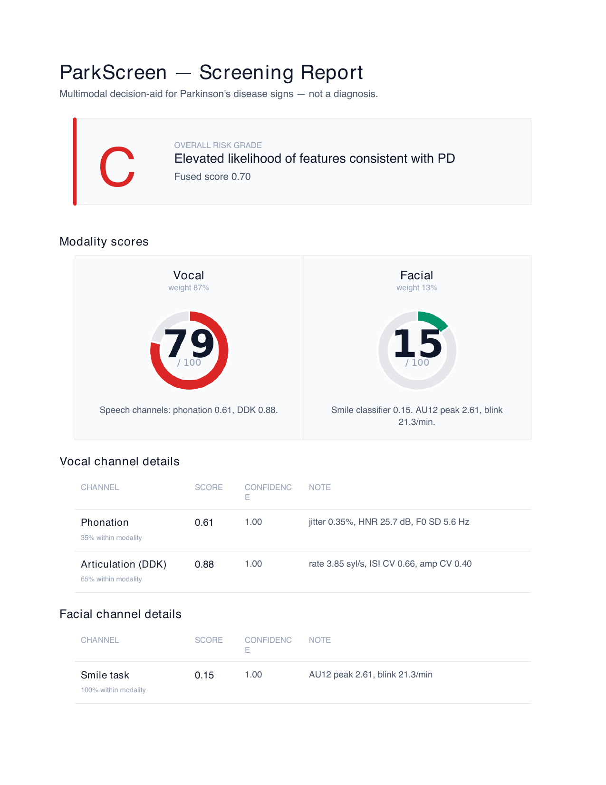

# ParkScreen

**Multimodal Parkinson's disease screening decision aid** — fuses phonation (sustained vowels), articulation (DDK / PATAKA rate + regularity), and facial dynamics (smile-task hypomimia) from three task-matched user uploads into a Claude-generated clinical-style report.

Built for the *Built with Claude: Life Sciences* hackathon (Anthropic × Gladstone × Cerebral Valley), July 7–13 2026. **Development Track.**

> ⚠️ ParkScreen is a **screening decision aid**, not a clinical diagnostic tool. Any elevated score should be interpreted only as a prompt to seek qualified clinical evaluation. See [`docs/LIMITATIONS.md`](docs/LIMITATIONS.md) before interpreting any output.

<p align="center">
  
</p>

*Example output — end-to-end run on the self-recorded PD demo case (Grade C, fused 0.70). Full PDFs + PNG snapshots for all three demo cases (HC Grade A, PD Grade C, NeuroVoz held-out Grade C with facial channel N/A) in [`demo/screenshots/`](demo/screenshots/). Reproduce with `python -m scripts.render_demo_pdfs`.*

---

## What ParkScreen Does

ParkScreen takes three task-matched recordings and returns a fused PD screening probability plus a narrative clinical-style report.

**Input** — three separate upload buckets, any of `.wav`, `.m4a`, `.mp4`, `.mov`:

1. **Sustained vowels /i/, /o/, /u/** — up to 3 reps per vowel, ~3–5 s each (audio-only OK).
2. **Rapid /pa-ta-ka/ (PATAKA)** — 1+ reps of ~7 s each, as fast and steady as possible (audio-only OK).
3. **8–12 s of smile ×3 (each time with 2~3 s) alternating with a neutral face (1~2 s)** — video, face clearly visible.

**Output** — a fused PD probability, per-channel scores with agreement flags, and a Markdown report generated by Claude with mandatory disclaimers and hedged language.

**Any bucket left empty** → that channel is reported as N/A and the fusion renormalizes over the remaining channels. The pipeline never silently reconciles disagreement between channels; disagreements are surfaced as *"flagged for clinical review"*.

---

## Headline Result

Subject-level LOSO on NeuroVoz analysis cohort (49 PD × 46 age-matched HC):

| Model | AUC [95% CI] | Sens | Spec |
|-------|--------------|------|------|
| Phonation-only | 0.567 [0.455, 0.678] | 0.490 | 0.674 |
| DDK-only (PATAKA) | 0.740 [0.632, 0.845] | 0.694 | 0.696 |
| **Phonation + DDK (AUC-excess weighted)** | **0.758 [0.662, 0.859]** | 0.633 | 0.717 |

Full 8-row ablation table + sensitivity analyses + cohort audit in [`docs/METHODOLOGY.md`](docs/METHODOLOGY.md). Rendered figures and reproduction in [`notebooks/ablation_results.ipynb`](notebooks/ablation_results.ipynb). Raw numbers in [`eval/results/ablation_table.csv`](eval/results/ablation_table.csv).

**Facial channel (trained separately on UFNet, evaluated separately):** in-distribution test AUROC 0.812 on UFNet's held-out participant split (vs paper's smile-only 0.830 SVM ensemble). External validation on YouTubePD: 0.708 on UFNet's designated subset, 0.602 on the full CSV. See METHODOLOGY §6.

---

## Quick Start

### Prerequisites

- macOS on Apple Silicon (`mlx_whisper` requires Apple Silicon; the repo will run elsewhere if you swap Whisper for the CPU/GPU version).
- Python 3.12 (`/opt/homebrew/opt/python@3.12/bin/python3.12` on Homebrew).
- `ffmpeg` (verify with `ffmpeg -version`; install via `brew install ffmpeg`).
- **Docker Desktop** — required to run the facial channel (OpenFace 2.0 via `algebr/openface`). Without Docker, the facial channel will fail gracefully with `N/A`.
- **Anthropic API key** — for the Claude report layer. Add to `.env` at repo root as `ANTHROPIC_API_KEY=sk-ant-...`.

### Install

```bash
git clone <this-repo> parkscreen
cd parkscreen
python3.12 -m venv .venv
source .venv/bin/activate
pip install -r requirements.txt

# For the facial channel
brew install libomp
docker pull --platform linux/amd64 algebr/openface:latest

# Copy the API key template
cp .env.example .env
# then edit .env to add your ANTHROPIC_API_KEY
```

### Run the Gradio demo

```bash
source .venv/bin/activate
python -m demo.app
```

Then open http://localhost:7860. Upload three task-matched dirs → click Analyze → view the report + score breakdown. The included `data/samples/hc_demo/`, `data/samples/pd_demo/`, and `data/samples/neurovoz_holdout_demo/` sample dirs are ready to use as smoke tests.

### Run the ablation (reproduces the headline table)

**Requires NeuroVoz** — see [`docs/DATASETS.md`](docs/DATASETS.md) §1 for how to obtain it and where to place the files.

```bash
source .venv/bin/activate

# Build the analysis cohort manifest
python -m src.data.build_labels
python -m src.data.build_cohort

# Extract features
python -m src.audio.phonation
python -m src.audio.ddk

# Run subject-level LOSO ablation
python -m eval.ablation

# Rendered plots + notebook
python -m eval.make_plots
jupyter nbconvert --execute notebooks/ablation_results.ipynb
```

Outputs land in [`eval/results/`](eval/results/): `ablation_table.csv`, `loso_oof_probs.csv`, `coefficients.csv`, and figures in `eval/results/figures/`.

### Run the CLI pipeline (no UI)

```bash
python -m src.pipeline \
  --vowel-dir data/samples/hc_demo/vowel \
  --pataka-dir data/samples/hc_demo/pataka \
  --smile-dir data/samples/hc_demo/smile \
  --out-dir out/hc_demo \
  --label HC
```

Add `--no-claude` to skip the report generation and inspect just the fusion context XML.

---

## Architecture

Two layers with different lifetimes:

- **Layer 1 (offline, on NeuroVoz):** score-level late fusion of two speech classifiers (phonation, DDK). Small linear models — logistic regression + StandardScaler — one per channel. Subject-level LOSO for evaluation. Produces the headline ablation table.

- **Layer 2 (real-time, on user upload):** three task-matched dirs → per-channel scoring using the fitted Layer-1 classifiers + a separately-trained facial classifier (on UFNet) → AUC-excess-weighted late fusion → structured context passed to Claude Opus 4.7 → Markdown clinical-style report with mandatory disclaimers.

For the full architectural rationale (why late fusion, why LogReg not deep learning, why three separate uploads instead of runtime segmentation, why we dropped Whisper/ASR from the demo path, why the facial channel uses OpenFace not py-feat) see [`CLAUDE.md`](CLAUDE.md).

---

## Repository Layout

```
parkscreen/
├── README.md                       # this file
├── CLAUDE.md                       # agent working handbook: architecture, feature specs, scope rules
├── LICENSE                         # MIT (code) + third-party attribution notes
├── TODO.md                         # deliverables checklist
├── requirements.txt
├── configs/                        # model.yaml, paths.yaml
├── docs/
│   ├── METHODOLOGY.md              # full methodology + sensitivity analyses + cohort audit
│   ├── LIMITATIONS.md              # evaluator-facing caveats
│   └── DATASETS.md                 # citations + licenses + DUA compliance
├── data/                           # gitignored
│   ├── raw/neurovoz/               # obtain from Zenodo, see docs/DATASETS.md §1
│   ├── raw/ufnet_smile/            # obtain from ROC-HCI GitHub, see docs/DATASETS.md §2
│   ├── processed/                  # cohort.csv + phonation_features/ + ddk_features/
│   └── samples/                    # demo dirs (hc_demo/, pd_demo/, neurovoz_holdout_demo/, ...)
├── src/                            # feature extraction, fusion, Claude client, pipeline
├── eval/                           # ablation, plots, deployment models
├── demo/                           # Gradio app + PDF export + canonical example artifacts
├── notebooks/                      # ablation_results.ipynb (executable visual companion to METHODOLOGY)
└── tests/                          # smoke tests
```

---

## Data and Attribution

ParkScreen uses three external datasets and one third-party facial extractor, each under its own license terms. **We do not redistribute any of these datasets** — reproducers must obtain them independently from the original sources.

| Component | Source | License |
|-----------|--------|---------|
| NeuroVoz (Spanish PD voice corpus) | Zenodo | Data Use Agreement (see [`docs/DATASETS.md`](docs/DATASETS.md) §1) |
| UFNet (smile-task feature CSV) | [ROC-HCI GitHub](https://github.com/ROC-HCI/UFNet) | MIT |
| YouTubePD (external validation only) | UFNet release | See DATASETS.md §4 |
| OpenFace 2.0 (facial AU extractor) | [OpenFace GitHub](https://github.com/TadasBaltrusaitis/OpenFace) | Non-commercial research use only |

Full citation entries, BibTeX, DUA compliance statements, and per-file attribution in [`docs/DATASETS.md`](docs/DATASETS.md).

---

## Limitations

- **Screening decision aid, NOT a clinical diagnosis.**
- Trained on subjects recorded ON medication — model calibration is not valid for OFF-state PD.
- Training cohort skews mild-to-moderate PD (Hoehn-Yahr stage 2 dominant); AUC does not extrapolate to severe PD.
- PD subjects are on average 5 years older than HC in the training cohort — some fraction of the AUC is measuring age.
- Trained on Spanish speakers; phonation and DDK features are language-neutral but cross-language transfer is untested.
- Small cohort (N=95); bootstrap 95% CI on AUC ≈ ±0.10.

Full catalog with mitigation notes: [`docs/LIMITATIONS.md`](docs/LIMITATIONS.md).

---

## Reproducibility

Every headline number in this README (and in `docs/METHODOLOGY.md`) is reproducible from the repository state at commit d935913 or later. Run order:

1. Obtain NeuroVoz and UFNet per DATASETS.md.
2. `python -m src.data.build_labels && python -m src.data.build_cohort` — cohort snapshot.
3. `python -m src.audio.phonation && python -m src.audio.ddk` — feature extraction.
4. `python -m eval.ablation` — subject-level LOSO.
5. `python -m src.vision.train_smile_pd --feature-set au_mean_var` — facial classifier (independent of NeuroVoz).

All artefacts land in `data/processed/`, `eval/results/`, and `eval/models/`.

Config snapshot for the run that produced current numbers: [`eval/results/ablation_summary.json`](eval/results/ablation_summary.json).

---

## License

Source code: **MIT License** (see [`LICENSE`](LICENSE)).

Datasets and third-party models used by this project remain under their own terms. See DATASETS.md and the third-party attribution section of `LICENSE`.

---

## Acknowledgments

- **Anthropic × Gladstone × Cerebral Valley** for hosting the *Built with Claude: Life Sciences* hackathon.
- **NeuroVoz** authors, for open-access release of the Spanish PD voice corpus under a workable DUA.
- **ROC-HCI** and **Islam et al. 2023**, for the smile-task PD screening methodology + released facial features that made our facial channel possible without collecting our own facial corpus.
- **OpenFace** authors, for a stable, dockerized AU extractor.
- **Anthropic Claude Opus 4.7 (1M context)** — the report-generation model.
